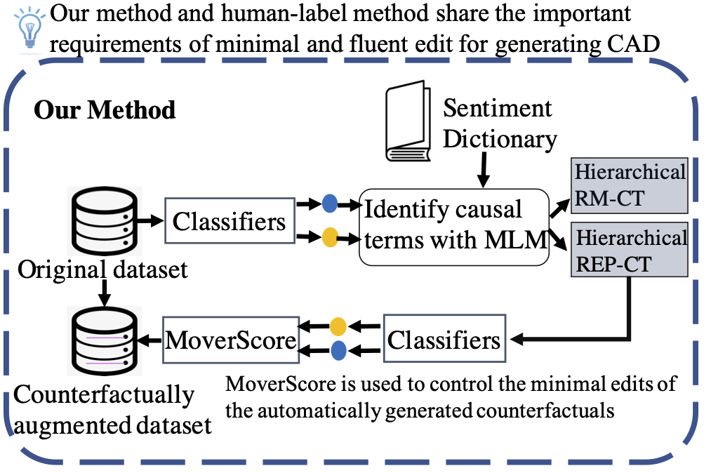

# Exploring the Efficacy of Automatically Generated Counterfactuals for Sentiment Analysis


This is the code repositry for the ACL-IJCNLP 2021 paper: ***[Exploring the Efficacy of Automatically Generated Counterfactuals for Sentiment Analysis](https://arxiv.org/pdf/2106.15231.pdf)***

Authors: Linyi Yang, Jiazheng Li, Pádraig Cunningham, Yue Zhang, Barry Smyth and Ruihai Dong

## Abstract

While state-of-the-art NLP models have been achieving the excellent performance of a wide range of tasks in recent years, important questions are being raised about their robustness and their underlying sensitivity to systematic biases that may exist in their training and test data. Such issues come to be manifest in performance problems when faced with out-of-distribution data in the field. One recent solution has been to use counterfactually augmented datasets in order to reduce any reliance on spurious patterns that may exist in the original data. Producing high-quality augmented data can be costly and time-consuming as it usually needs to involve human feedback and crowdsourcing efforts. In this work, we propose an alternative by describing and evaluating an approach to automatically generating counterfactual data for the purpose of data augmentation and explanation. A comprehensive evaluation on several different datasets and using a variety of state-of-the-art benchmarks demonstrate how our approach can achieve significant improvements in model performance when compared to models training on the original data and even when compared to models trained with the benefit of human-generated augmented data.

<p align="center">

</p>

## Getting Started

Default project structure:
```
	Counterfactuals-for-Sentiment-Analysis
	├── README.md
	├── Introduction.png
	├── .gitignore
	├── requirements.txt
	├── run.sh
	├── cfsa.py
	├── cfsa
	│   ├── cfsa.py
	│   ├── cfsarep.py
	│   ├── cfsarm.py
	│   ├── constants.py
	│   └── loader.py
	├── mvscore
	│   └── mvscore.py
	├── sa_dictionary
	│   ├── neg_proun.npy
	│   ├── negative.txt
	│   └── positive.txt
	├── model
	│   ├── best-checkpoint
	│   │   └── ...
	│   └── ...
	└── outputs
		 	└── ...
```

### Setup


1. Install `conda` and `pip` if you do not already have them. Create a new Python 3.7 env and activate.

    ```bash
    conda create --name cfsa python=3.7 
    conda activate cfsa
    ```

1. Clone this repository:

    ```
    git clone https://github.com/lijiazheng99/Counterfactuals-for-Sentiment-Analysis.git
    ```

1. Install required dependencies with `pip`: 

    ```bash
    pip install -r requirements.txt
    ```

### How to run a sample

*Note: requires internet connection and GPU access.*

1. Download a sample model from [here](https://drive.google.com/file/d/1Nli4xsdvPkpaYw2gh7kwewoTeXJ2Bu7O/view?usp=sharing), unzip into the default language model folder `model/`.

1. Run the sample: 

    ```bash
    python cfsa.py --best_model model/best-checkpoint/ --tokenizer model/
    ```

## Field Specification of setting conf json.
   
| Arguments   | Description |
| ----------- | ----------- |
| `--train_set` | Specify the path to the train set. Default value is a [link](https://raw.githubusercontent.com/acmi-lab/counterfactually-augmented-data/master/sentiment/orig/train.tsv) to the default train set. |
| `--dict_path` | Specify the path to dictionaries. Default folder is `sa_dictionary/` |
|`--model`| Setting for model type. This project is designed to take four types of configurations `bert-base`, `bert-large`, `roberta` and `xlnet`. The default value is `bert-base`. You can check out [Hugging Face Transformers](https://huggingface.co/transformers/pretrained_models.html) and edit [constants.py](https://github.com/lijiazheng99/Counterfactuals-for-Sentiment-Analysis/blob/master/cfsa/constants.py) to explore more models.|
|`--token_length`| Specify the token length for your current language model, default setting is `128`.|
|`--best_model`| Path to the best checkpoint for your fine-tuned model.|
|`--tokenizer`| Path to the tokenizer of your fine-tuned model.|
|`--output_path`| Path to the output folder for store generated counterfactuals and logs. The default value is `outputs/`.|
|`--cuda`| (Not necessary) Specify the GPU, if you have multiple GPUs.|
|`--store_cfs`| (Not necessary) Stores unselected conterfactuals data.|

### Fine-tune your language model

Please checkout these [examples](https://huggingface.co/transformers/custom_datasets.html) from [Hugging Face Transformer](https://huggingface.co/), to fine-tune your custom models.

## Out-of-Domain Tests (OOD)

To be available soon. 

